# EXPLORATORY-DATA-ANALYSIS-on-RETAIL-SALES-DATA
## INTRODUCTION
&nbsp;&nbsp;&nbsp;&nbsp;&nbsp;&nbsp;In today's competitive retail industry, data-driven insights play a vital role in business growth and decision-making. This project focuses on analyzing a dataset containing 1,000 rows and 9 columns of retail sales data using Python. The primary objective is to perform Exploratory Data Analysis (EDA) to uncover patterns, trends, and key insights that can help the retail business optimize sales, improve inventory management, and enhance overall performance.  
By leveraging Python libraries such as Pandas, Matplotlib, and Seaborn, this analysis will involve data cleaning, visualization, and statistical exploration to identify key sales drivers and customer behavior trends. The findings from this study will provide actionable recommendations to support data-driven decision-making and business strategy improvements.
## PROBLEM STATEMENT
1. Descriptive Statistics: Calculate key statistics (mean, median, mode, and standard deviation) for:
   - Quantity
   - Price per Unit
   - Total Amount
2. Sales Trend Analysis:
   - Calculate total monthly sales performance over time
   - Analyze the average monthly sales trend
3. Customer Demographics & Purchasing Behavior:
   - Analyze gender distribution of customers
   - Identify total revenue and average spending per customer
   - Calculate average spending per gender to assess purchasing patterns
4. Visualization:
   - Group sales by product category
   - Identify and visualize the top three best-selling product categories
   - Compute and visualize the correlation matrix between Quantity, Price per Unit, and Total Amount.

## SKILLS AND CONCEPTS DEMONSTRATED 
1. Data Manipulation & Cleaning
2. Descriptive Statistics & Exploratory Data Analysis (EDA)
3. Time Series Analysis
4. Data Visualization
5. Customer & Product Analysis
6. Correlation & Insights Extraction
 

## STAGES TO NAVIGATE IN THE EXPLORATORY DATA ANALYSIS PROJECT on RETAIL SALES DATA

The project comprises four critical stages essential for successful completion, which encompass:
1. Libraries and Data Importation
2. Data Assessment to Detect Data Quality Issues
3. Data Cleaning
4. Data Manipulation and Data Visualization

#### EXPLANATIONS

1. "Libraries and Data Importation":
   ---  
The first step of this project is to import the essential libraries required for data analysis and visualization. In this case, the following libraries are used:
- Pandas (pd) for data importation and manipulation.
- Numpy as (np) for numerical operations
- Datetime (dt) to handle date-related operations.
- Matplotlib.pyplot (plt) and Seaborn (sns) for data visualization.
- Warnings to suppress unnecessary warnings during execution.
  
Once these libraries are imported, the next step is to load the sales dataset into the Jupyter Notebook environment as a DataFrame using the pd.read_csv() function. The dataset is assigned to a variable named df, allowing easy reference throughout the analysis.  

&nbsp;&nbsp;&nbsp;&nbsp;The following code snippet imports the necessary Python libraries for data analysis and visualization:

```python
import pandas as pd   
import numpy as np  
import datetime as dt  
import matplotlib.pyplot as plt     
import seaborn as sns   
import warnings   
warnings.filterwarnings('ignore')  

df = pd.read_csv(r'C:\Users\HP\Downloads\retail_sales_dataset.csv')  
df
```
LIBRARIES AND DATA IMPORTATION
:-----------------------------:
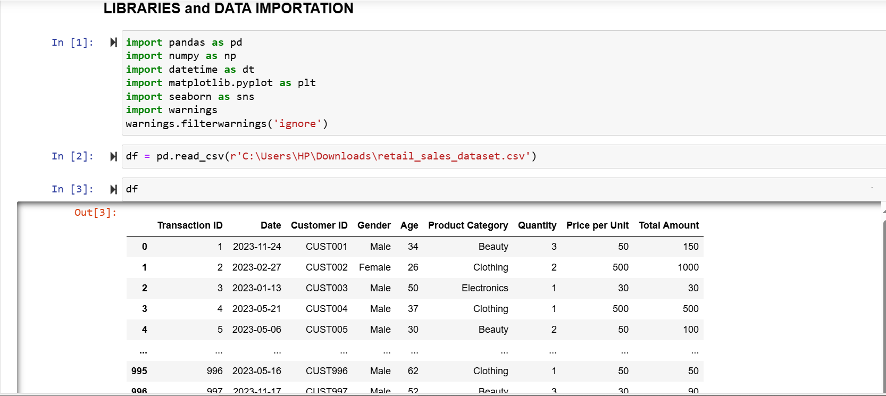

2. "Data Assessment to Detect Data Quality Issues":
   --- 
Data assessment is the fundamental process of evaluating imported data to determine its suitability and cleanliness for its intended purpose. There are two primary methods of data assessment: virtual assessment and programmatic assessment. In this case, programmatic assessment was utilized, which involves assessing data using codes, especially when dealing with datasets containing numerous rows and columns that cannot be feasibly examined manually.

Several attributes and functions provided by the pandas library were employed for data assessment, including:

- df.shape: It returns the dimensions of the DataFrame (number of rows and columns). In this case, the dataset contains 1,000 rows and 9 columns.
- df.info(): This provides a concise summary of the DataFrame, including data types and memory usage. The output revealed that the "date column" has an incorrect data type (object - instead of datetime), as highlighted with a yellow rectangle shape in the snapshot below.
- df.isnull().sum(): Counts the number of missing values in each column. The result indicates that there are no missing values in the dataset.
- df.duplicated().sum(): Identifies duplicate rows in the DataFrame. The output confirms that no duplicate records are present.
 
Findings:  
&nbsp;&nbsp;&nbsp;&nbsp;&nbsp;&nbsp;&nbsp;&nbsp;Based on these assessments, the only data quality issue detected was the incorrect data type for the date column.

These assessments and data quality issue detected are illustrated in the snapshots below. 
A    |B    
:---:|:---:
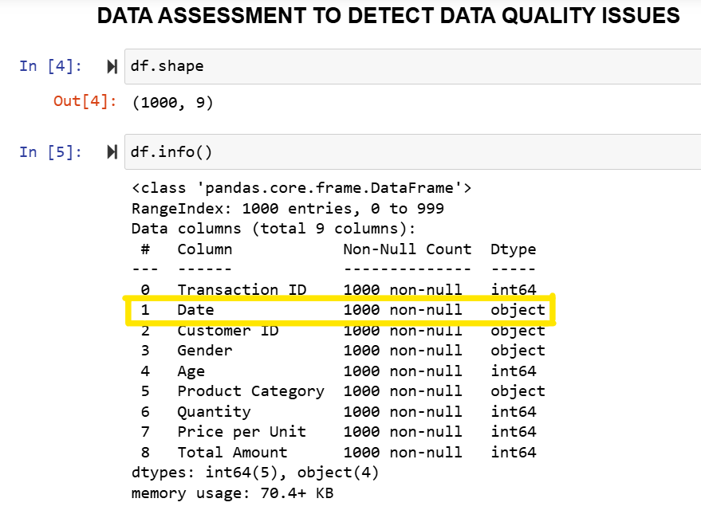|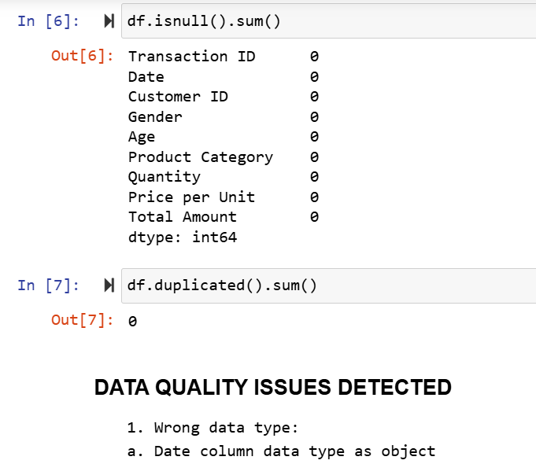

3. "Data Cleaning":
   ---
From the data assessment, the date column was identified as having an incorrect data type (object). To ensure accurate time-based analysis, it needs to be converted to the correct datetime format.

To resolve this issue, we would use the to_datetime() function from the Pandas library:
```python

df['Date'] = pd.to_datetime(df['Date'])  
df.info()
``` 
After executing this code, the date column is successfully converted to the correct datetime data type. The snapshot below highlights the data type before and after cleaning, enclosed in a yellow rectangular shape.
BEFORE CLEANING  |AFTER  CLEANING
:---------------:|:--------------:
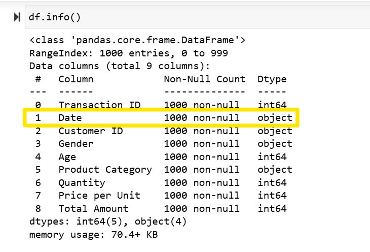|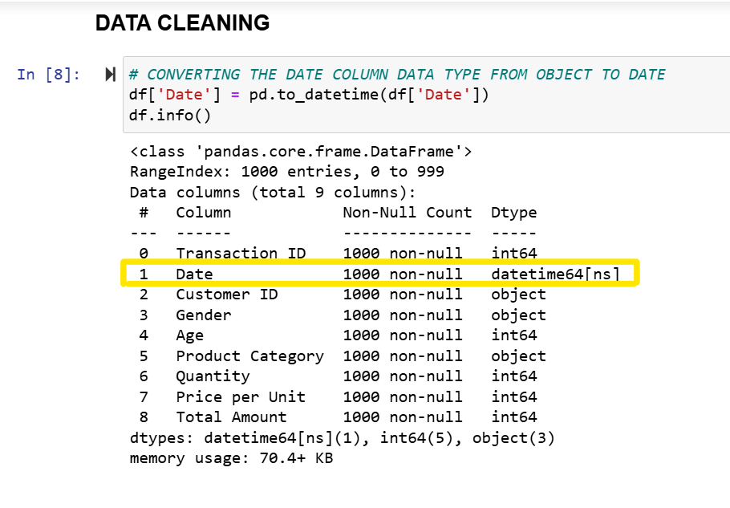

4. "Data Manipulation and Visualization (Analysis of the Problem Statement)":
   ---
1, Descriptive Statistics: Calculate key statistics (mean, median, mode, and standard deviation) for:
   --
   - Quantity
   - Price per Unit
   - Total Amount
   ---
&nbsp;&nbsp;&nbsp;&nbsp;&nbsp;&nbsp;&nbsp;To compute the mean, median, mode, and standard deviation for Quantity, Price per Unit, and Total Amount, we first store these columns in a variable for easy reference. In this case, we assign them to a variable named columns.  
Next, we calculate the statistical measures using a dictionary, storing the results in a variable called statistics. Finally, we convert the dictionary into a DataFrame for better visualization. 
&nbsp;&nbsp;&nbsp;&nbsp;&nbsp;&nbsp;&nbsp;The computed statistics are presented in the table below:
METRIC           |MEAN            | MEDIAN    |MODE       |STANDARD DEVIATION
:---------------:|:--------------:|:---------:|:----------:|:----------------:
Quantity	        |2.514           |	3.0	    |4	              |1.132734        
Price per Unit   |179.890         |	50.0    	 |50	           |189.681356      
Total Amount	  |456.000         |	135.0	    |50	           |559.997632      

The code used for this calculation, along with the resulting output, is shown in the snapshot below.

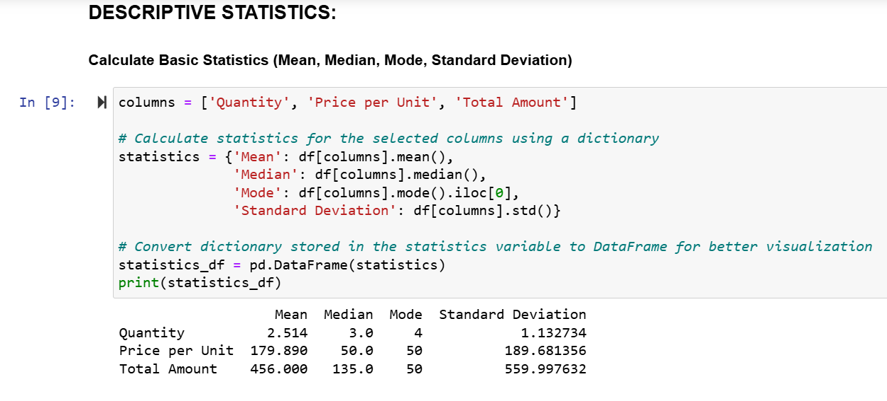

2, Sales Trend Analysis:
   --
   - Calculate total monthly sales performance over time  
   - Analyze the average monthly sales trend  
   ---
&nbsp;&nbsp;&nbsp;&nbsp;&nbsp;&nbsp;&nbsp;To analyze sales trends over time, the date column should be set as the index, which is essential for time series analysis. The conversion of the date column to an index is shown in the snapshot below.
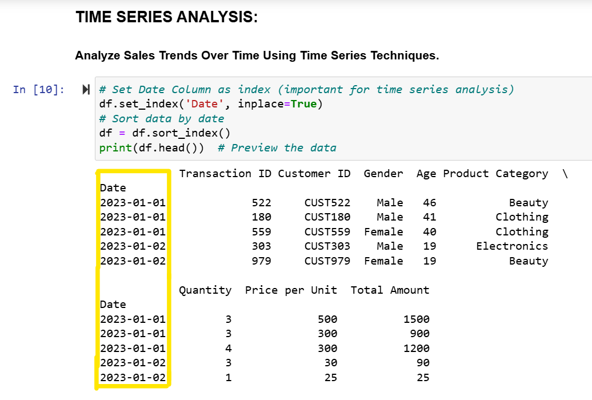


- Calculate total monthly sales performance over time:
  --  
  The total monthly sales performance can be calculated by resampling the data by month and summing the Total Amount column. The result is stored in a variable named "sales_trend". After computing the sales trend, we plot a line graph using plt.plot(), applying necessary formatting and adjustments to enhance readability.

&nbsp;&nbsp;&nbsp;&nbsp;&nbsp;&nbsp;&nbsp;The complete code used for this analysis, along with the resulting visualization, is shown in the snapshot below.
LINE of CODES    |VISUALIZATION
:---------------:|:--------------:
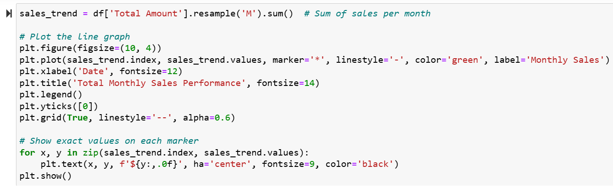|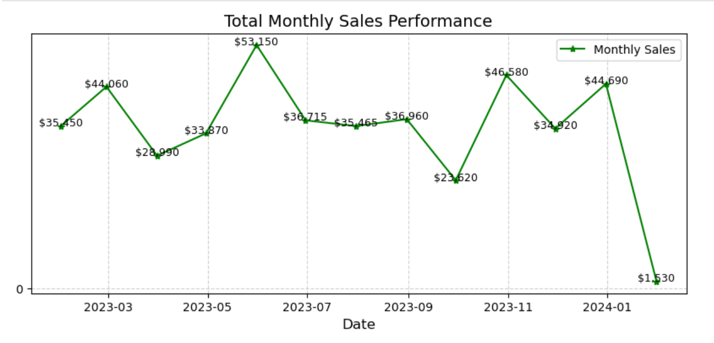

- Analyze the average monthly sales trend:
  --
  To analyze the average monthly sales trend, we resample the data by month and apply the mean function to calculate the average Total Amount for each month. The result is stored in a variable named "sales_trend". After computing the sales trend, we visualize it using a line graph with plt.plot(), applying appropriate formatting and adjustments to improve readability.

&nbsp;&nbsp;&nbsp;&nbsp;&nbsp;&nbsp;&nbsp;The complete code used for this analysis, along with the resulting visualization, is shown in the snapshot below.
LINE of CODES    |VISUALIZATION
:---------------:|:--------------:
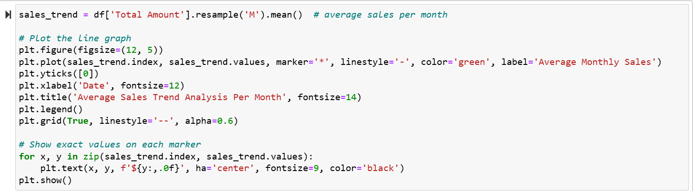|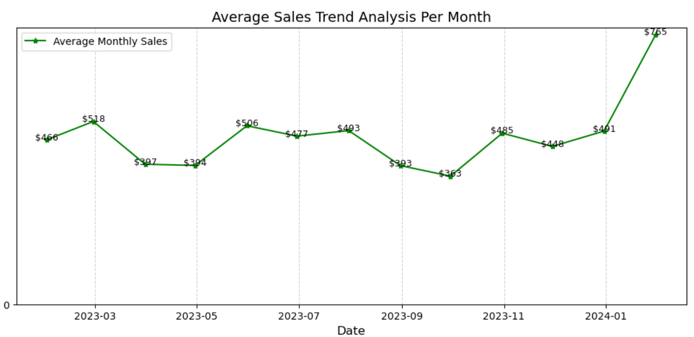

3, Customer Demographics & Purchasing Behavior:
   --
   - Analyze gender distribution of customers
   - Identify total revenue and average spending per customer
   - Calculate average spending per gender to assess purchasing pattern.
   ---
- Analyze gender distribution of customers:
  --
  To analyze the gender distribution of customers, we use the value_counts() function with the normalize=True parameter to calculate the percentage of each gender. Multiplying by 100 converts the proportions into percentages. The following line of code performs this calculation:
  ```python
  print(df['Gender'].value_counts(normalize=True) * 100)
  ```
  The output of this analysis shows that:
  
  51.0% of customers are female  
  49.0% of customers are male.
  
- Identify total revenue and average spending per customer:
  --
  To determine the total revenue and average spending per customer, we use the sum and mean functions on the Total Amount column. These calculations are stored in two separate variables:  
  total_revenue: Stores the total revenue by summing all values in the Total Amount column.
  average_spending: Stores the average spending per customer by calculating the mean of the Total Amount column.  
  The following code snippet performs these calculations:
  ```python
  total_revenue = df['Total Amount'].sum()  
  average_spending = df['Total Amount'].mean()  
  print(f"Total Revenue: ${total_revenue:,.2f}")  Formats the total revenue with commas and two decimal places for readability.
  print(f"Average Spending per Customer: ${average_spending:,.2f}") Formats the average spending with two decimal places.
  ```
  The output of this analysis is seen below:
    
  Total Revenue: $456,000.00  
  Average Spending per Customer: $456.00

- Calculate average spending per gender to assess purchasing pattern:
  --
  To compute the average spending per gender, we use the following approach:  
  groupby('Gender'): Groups the data by gender.  
  mean(): Calculates the average (mean) of the Total Amount column for each gender.  
  round(1): Rounds the result to one decimal place for better readability.  
  Store the result in a variable named avg_spending_gender.  
  The following code snippet performs this analysis:
  ```python
  avg_spending_gender = df.groupby('Gender')['Total Amount'].mean().round(1)  
  print(avg_spending_gender)
  ```
  The output of this analysis is:
  GENDER           | RESULT            
  ---------------|--------------|
     Female      |456.5
     Male	     |455.4         |

The snapshot below shows the customer demographics & purchasing behavior.  
  
  Customer Demographics & Purchasing Behavior
  :-----------------------------:
  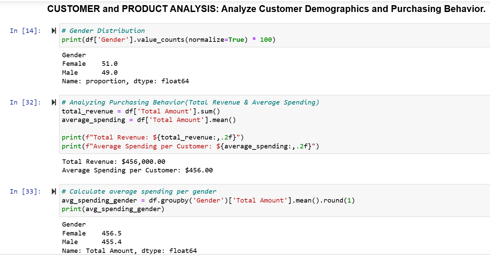

4, Visualization:
   --
   - Identify and visualize the top three best-selling product categories
   - Compute and visualize the correlation matrix between Quantity, Price per Unit, and Total Amount
   ---
   - Identify and visualize the top three best-selling product categories:
     --
     To identify and visualize the top three best-selling product categories, we follow these steps:

     - Group the data by the Product Category column using the groupby() function.
     - Sum the Total Amount for each category using the sum() function.
     - Sort the values in descending order using sort_values(ascending=False).
     - Extract the top 3 categories using the head(3) function.
     - Store the result in a variable named top_categories, which will be used for visualization.  
     The following code performs this analysis:

     ```python
     top_categories = df.groupby('Product Category')['Total Amount'].sum().sort_values(ascending=False).head(3)
     ```
     To create a seamless bar chart, we use plt.bar(), followed by additional formatting steps such as:
     - Adding labels and a title for better readability.
     - Removing unnecessary borders to enhance visualization.
     - Displaying exact values on each bar for clarity.   
     (The complete code for this visualization is shown in the snapshot below).
     
     The top 3 selling product categories are:
     - Electronics – $156,905.00 (highest sales)
     - Clothing
     - Beauty
     
     LINE of CODES    | BAR CHART VISUALIZATION
     :---------------:|:--------------:
     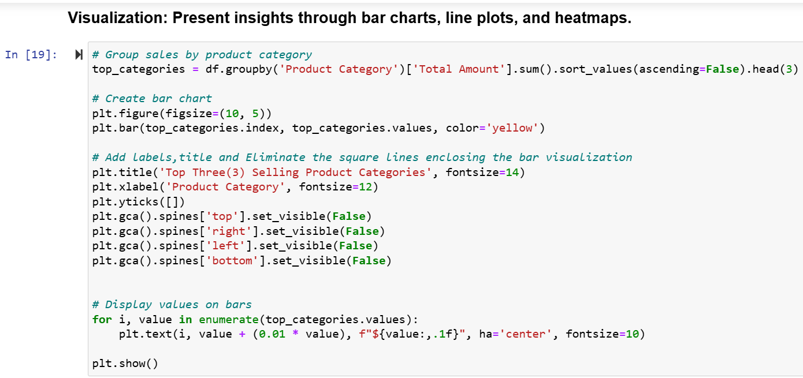|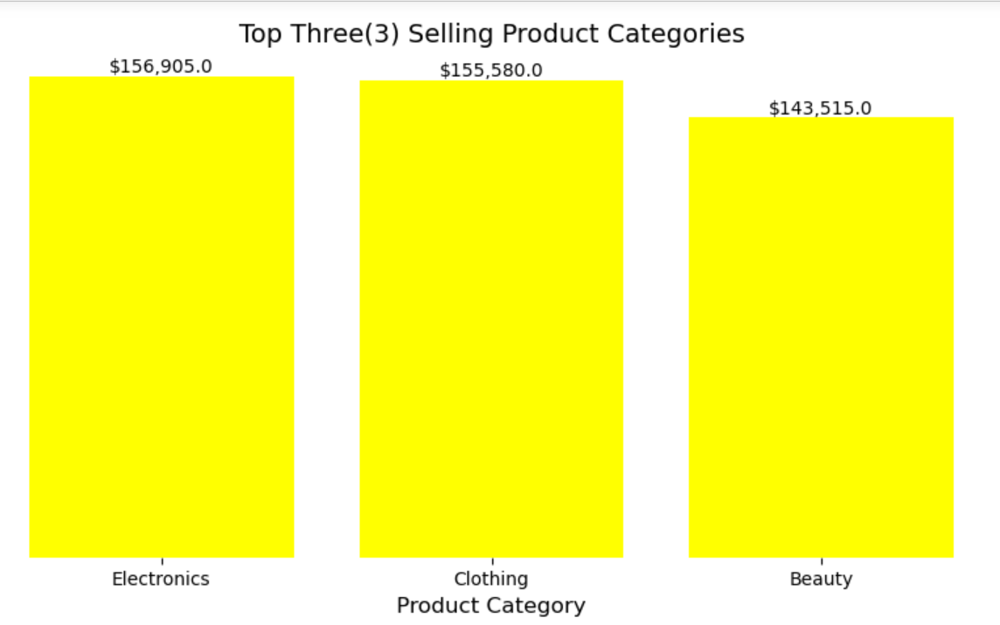

     Pie Chart:  
     &nbsp;&nbsp;&nbsp;&nbsp;&nbsp;&nbsp;&nbsp;To better understand the sales distribution among the top 3 selling product categories, we can use a pie chart to display 
     their percentage contributions. This is 
     achieved using the plt.pie() function, where we pass the necessary arguments to customize the visualization.(The code snippet for this visualization is shown in the 
     snapshot below).  
     The results of the code snippet shows that:
     - Electronics: 34.4% (highest sales percentage)
     - Clothing: 34.1%
     - Beauty: 31.5%

     LINE of CODES    | PIE CHART VISUALIZATION
     :---------------:|:--------------:
     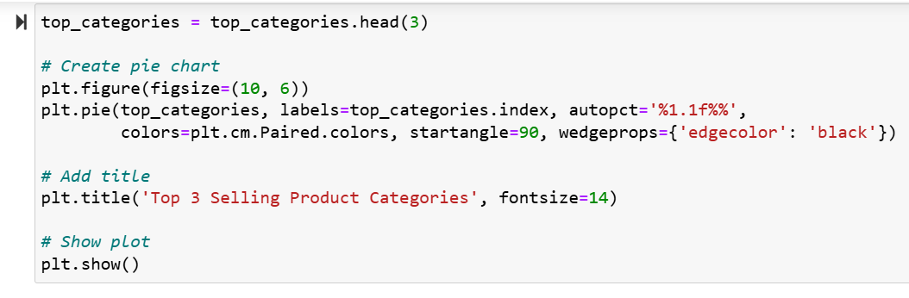|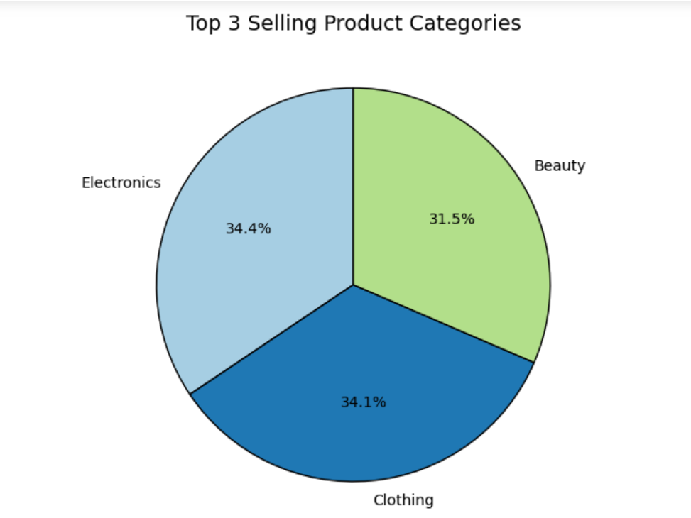
     
   - Compute and visualize the correlation matrix between Quantity, Price per Unit, and Total Amount:
     --
     To analyze the relationship between Quantity, Price per Unit, and Total Amount, we compute the correlation matrix and visualize it using a heatmap. The code 
     snippet that achieves this is found in the snapshots below:
      LINE of CODES and VISUALIZATION    
     :-------------------------------:
     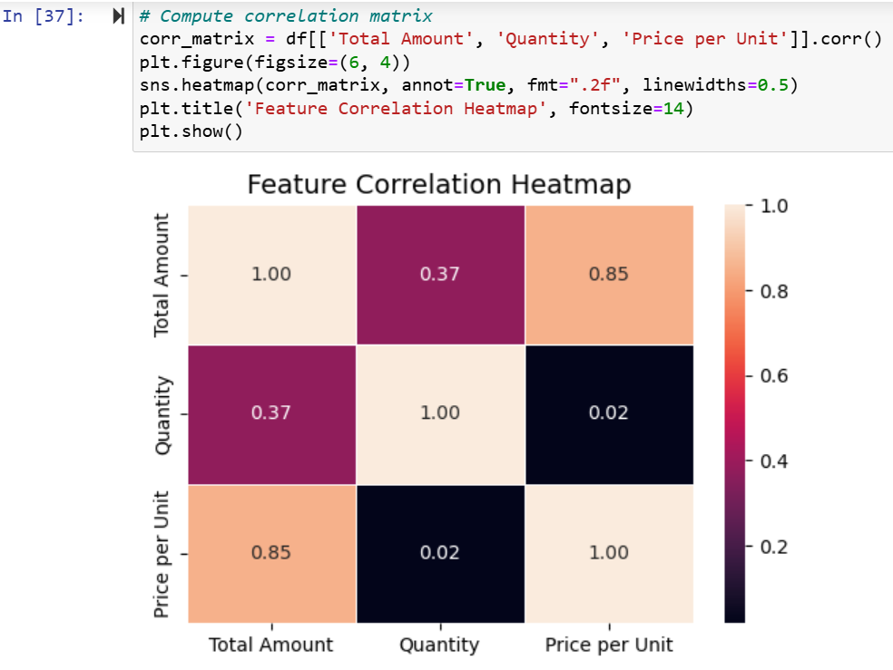

 


 

   

   


